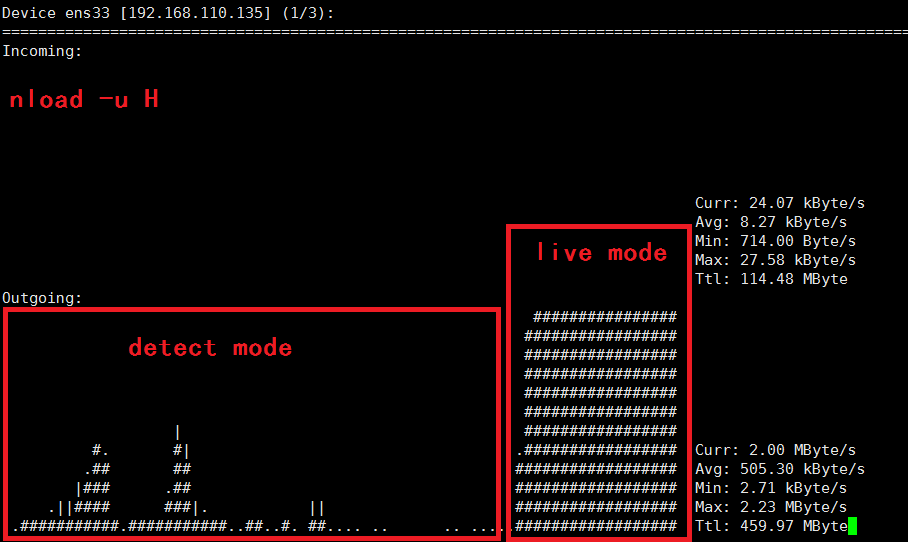

# rtm2


English | [中文](README-zh.md)

**A real-time motion monitor**


## Table of Contents
- [Introduction](#Introduction)
- [Install and usage](#Install)
- [Todo](#Todo)
- [Similar projects](#Similar_works)


## Introduction
**rtm2** is a real-time motion monitor developed by python3, flask, [socketIO](https://socket.io/) and openCV.
Unlike [similar projects'](#Similar_works) transferring every frame to clients, rtm2 send frames and notices to clients using [websocket protocol](https://en.wikipedia.org/wiki/WebSocket) only when motion🏃 detected.
It can send data real-time and avoid unnecessary traffic transfer.

There are many motion detecting projects that combined openCV with web. As far as I know, clients get frames that captured by openCV in the way of solutions shown below, mainly.

 **1. ajax/xhr polling** <br>
 clients(browser) send query to server every N seconds:
 ```javascript
function check_update() {
    var xhr = new XMLHttpRequest();
    xhr.open('get','/some/url/to/check/update',true);
    xhr.send();
    if(xhr.readyState === 4){
        if(xhr.status === 200){
            // function to show image
        }
    }
}
setInterval(check_update, 1000)
```
It's not real-time and could cause heavy server load.


 **2. [multipart](https://www.w3.org/Protocols/rfc1341/7_2_Multipart.html) protocal** <br>
 clients browser
 ```html

```
 server
```python
def gen():
    """Video streaming generator function."""
    while True:
        read_return_code, frame = vc.read()
        encode_return_code, image_buffer = cv2.imencode('.jpg', frame)
        io_buf = io.BytesIO(image_buffer)
        yield (b'--frame\r\n'
               b'Content-Type: image/jpeg\r\n\r\n' + io_buf.read() + b'\r\n')


@app.route('/video_feed')
def video_feed():
    """Video streaming route. Put this in the src attribute of an img tag."""
    return Response(gen(), mimetype='multipart/x-mixed-replace; boundary=frame')
```
Sending every frame to clients can cause lots of unnecessary traffic transfer.
It's suitable for live streaming, but may not suitable for monitor. 
What's more, it's easy to disconnect.


 **3. [imageZMQ](https://github.com/jeffbass/imagezmq)** <br>
advantage: real-time and distributable

disadvantage: you can't view frames on browser, you have to write/install a new program on your device.

 **4. ffmpeg + rtmp** <br>

 **5. [websocket](https://en.wikipedia.org/wiki/WebSocket) protocol** <br>
when server have frames to send to clients:
 + server send frames url to clients using websocket protocol, then client(browser) execute `img.src='http://domain.com/img/1.jpg'`
 
   Modifying `img.src` too frequently would cause image url changed before it loaded, which lead to no image is shown.
   But, this is a good solution when the frame rate is very low.
   
 + encode frame with base4, then send base64 string to clients using websocket protocol
 
   It cause meaningless calculation and increase amount of data to transfer.
   
 + send frame binary(converted to jpg) to clients directly using websocket protocol. Then execute js shown below to display image.
 
 ```js
    let blob = new Blob([msg], {type: 'image/jpeg'});
    img.src = window.URL.createObjectURL(blob);
 ```
   This is the solution that I used. 


## Install
### ubuntu
```shell script
$ wget https://github.com/def-fun/rtm2/master.zip
$ unzip master.zip
$ cd master/
$ pip3 install -r requirements.txt
$ gunicorn --worker-class eventlet -w 1 app:app -b 0.0.0.0:5000  # ubuntu
```


If terminal shows something like:
```
[ WARN:0] global /io/opencv/modules/videoio/src/cap_v4l.cpp (802) open VIDEOIO ERROR: V4L: can't open camera by index 0
```
it means you need to install right webCamera drive (note: you can get driver from http://www.ideasonboard.org/uvc/),
 or run command with `sudo`.
```shell script
[def@ubuntu ~/rtm2/rtm2]$ which gunicorn 
/home/def/.local/bin/gunicorn
[def@ubuntu ~/rtm2/rtm2]$ sudo /home/def/.local/bin/gunicorn --worker-class eventlet -w 1 app:app -b 0.0.0.0:5000
```


### windows
install python3 first, then download [master.zip](https://github.com/def-fun/rtm2/master.zip) and uncompressed it.
Open cmd
```cmd
> cd master/
> pip install -r requirements.txt
> python app.py
```

Then visit http://127.0.0.1:5000/ 
Detecting will start after the first visit. The default stream mode is detect mode, which can avoid lots of network traffic, as image shown below.



## Todo
+ optimize network transfer, for example, transfer changed area only.
+ alarms or vibrate your device(mobile phone) when motion detected.
+ beautify web page
+ face recognition, YOLO, and so on

I'm have little experience in programing. So, current web page is ugly,  many function haven't been finished, and English README need to be polished. 
I hope you can help me.

Pull requests are welcome :)


## Similar_works
https://www.pyimagesearch.com/2019/04/15/live-video-streaming-over-network-with-opencv-and-imagezmq/
https://blog.miguelgrinberg.com/post/video-streaming-with-flask
https://gist.github.com/n3wtron/4624820 
https://github.com/Kr1s77/flask-video-streaming-recorder 
https://www.geeksforgeeks.org/webcam-motion-detector-python/ 
https://www.pyimagesearch.com/2015/06/01/home-surveillance-and-motion-detection-with-the-raspberry-pi-python-and-opencv/ 
https://www.pyimagesearch.com/2019/09/02/opencv-stream-video-to-web-browser-html-page/ 
